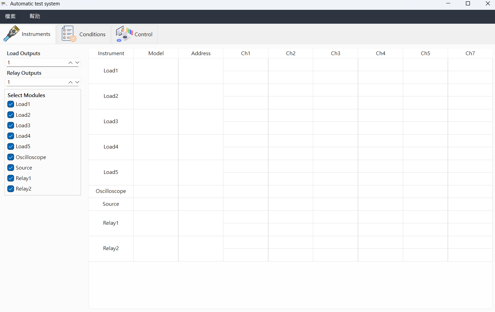
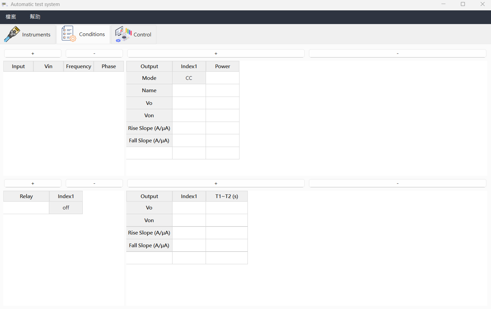
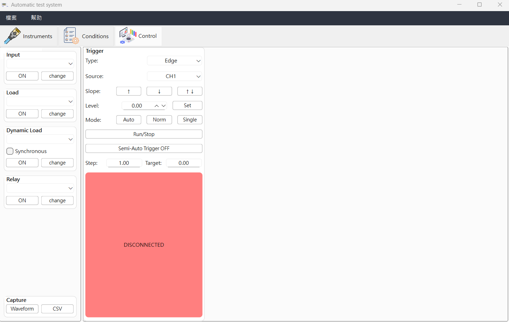

# ElectronicATE
> 電子ATE自動化測試系統  
> Qt + C++ + CMake

---

## 📸 功能展示

### 主控制介面


### 儀器設定頁面


### 測試執行畫面


---

## 📖 介紹

ElectronicATE 是一套用於自動化電子測試的軟體模板，支援多種儀器（AC Source, DC Load, Oscilloscope..），通訊採用(GPIB, TCP/IP, Serial..)，
採用 MVVM 架構、Qt GUI 開發 (LGPL)。適合電子量測、自動化測試、工廠自動控制等應用。

---

## ✨ 功能特色

- 預計支援多種儀器協議 (GPIB, TCP/IP, Serial)
- 儀器組態XML設定自動保存/載入
- 儲存設定檔案系統
- MVVM - 主要架構模式UI資料與測試邏輯分離(View/Viewmodel/Model與signal/slot實作)
- OOP - 儀器架構採用物件導向繼承多型呼叫方法
- 多執行緒 (QtConcurrent) 非阻塞儀器通訊
- 目前支援 Chroma6310、DE-A3000AB、DPO7000設備
- 示波器UI可動態生成避免雜亂畫面
- 錯誤彈窗提示

---

## 🚀 安裝與建構 (Windows 範例)

1. 安裝 Qt 6 (建議6.9)
2. 安裝 CMake
3. 用 Qt Creator 或 CMake 指令建構
4. 建議為window11系統(GUI設計風格)

---

## 🖼️ 圖片Icon來源

1. https://www.flaticon.com/

---

## 📁 資料夾說明
```
ElectronicATE/
├── src/              主程式原始碼
├── images/           UI圖檔/Logo
├── screenshots/      README展示圖片
├── XML/              儀器組態範例
├── build/            編譯產物 (不納入版控)
└── CMakeLists.txt    CMake建構腳本
```

---

## 📋 TODO / 計畫

- [ ] 增加更多儀器協議支援(AC Source、DC Load、Oscilloscope、Relay...etc)
- [ ] 優化過長及嵌套程式碼

---

## 📧 聯絡方式

- 作者：Jaxon Su
- GitHub: [@Jaxon-Su](https://github.com/Jaxon-Su)

---

## 📄 授權

本專案使用 Qt (LGPL) 授權
