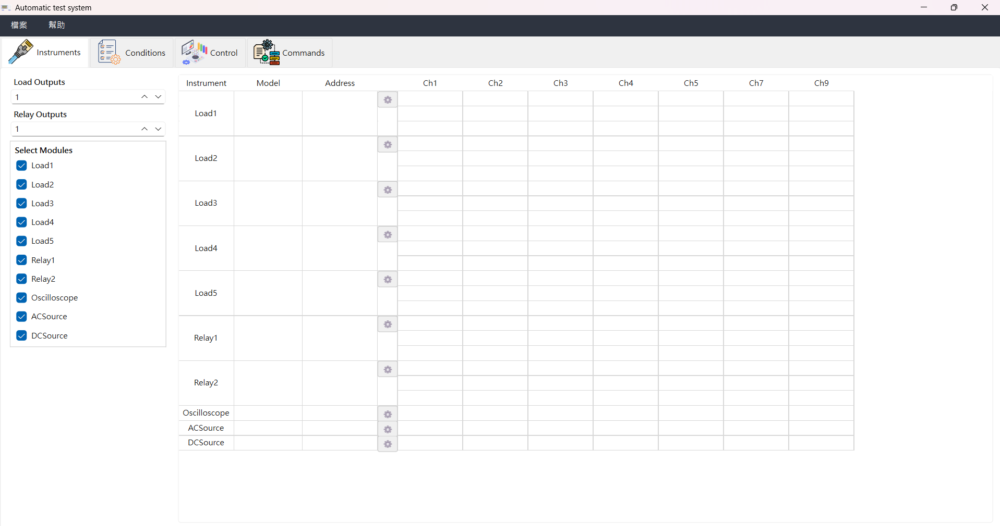
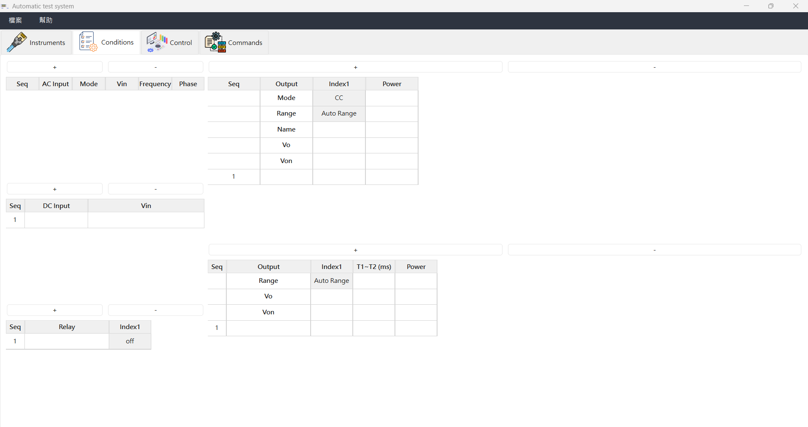
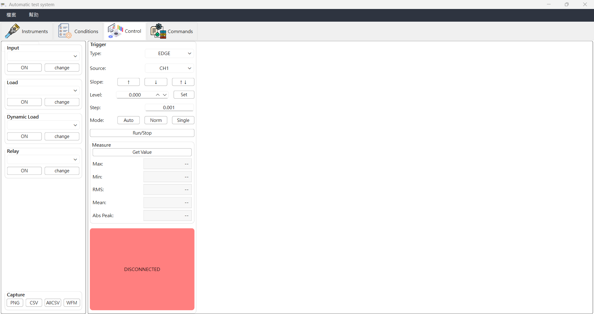
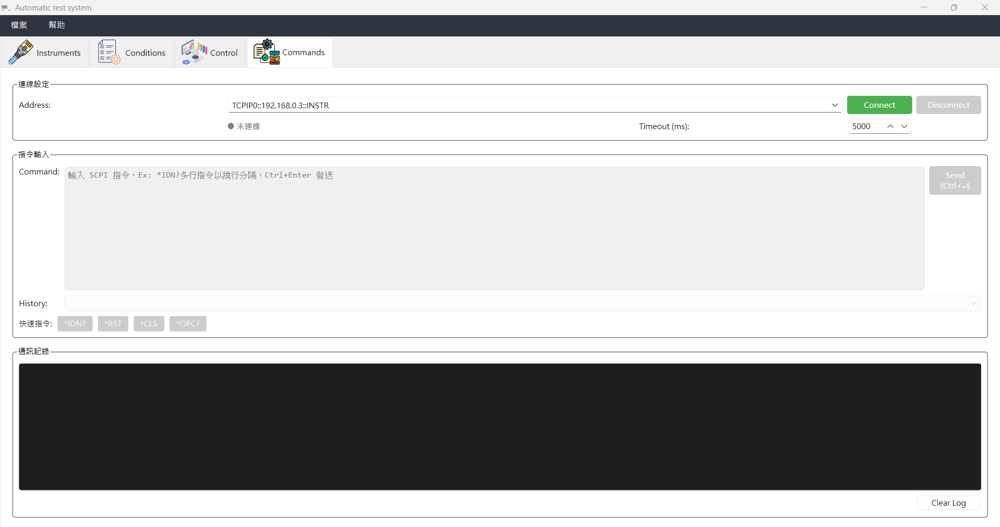

# ElectronicATE

電子 ATE 自動化測試系統  
Qt 6 + C++17 + CMake + MVVM

ElectronicATE 是一套用於電源供應器、電子負載、示波器與繼電器控制的 Windows 桌面測試平台。專案以 Qt Widgets 實作 GUI，透過 MVVM 分層管理 UI、測試條件、儀器設定、XML 保存/載入與硬體控制流程。

---

## 目前功能

### Page1：儀器與通訊設定

- 從 `XML/Instrument.xml` 讀取儀器模板與可選型號。
- 支援多組 Load、Relay、Oscilloscope、InputSource 設定。
- 支援 Load Outputs / Relay Outputs 數量設定。
- 支援通道型儀器的 subModel、output index、sync role 設定。
- Load sync role 支援 `MASTER` / `SLAVE` / `NONE`。
- 63640 使用 `63600-5` 模板，通道為 `1,3,5,7,9`。
- 通訊設定目前下拉可選 GPIB、TCP/IP、Serial、Modbus RTU。

### Page2：測試條件表格

- Input 條件表：phase mode、Vin、frequency、phase。
- DC 表：DC Vin 條件。
- Relay 表：繼電器輸出條件。
- Load 表：mode、range、name、Vo、Von 與各條件電流/電壓資料。
- Dynamic Load 表：range、Vo、Von、T1/T2 與動態電流條件。
- 支援新增/刪除列、表格 copy/paste/delete、鍵盤導覽與資料同步。
- 依 Page1 output 數量動態更新表頭、欄位與功率欄。
- Load / Dynamic Load 會依儀器 subModel 提供可用 range/mode 選項。

### Page3：手動控制與擷取

- Input Source：Power On / Off / Change。
- Load：Load On / Off / Change。
- Dynamic Load：Dynamic Load On / Off / Change。
- Relay：Relay On / Off / Change。
- Load 與 Dynamic Load 在 UI 上互鎖，避免同時啟用。
- 示波器 trigger widget 依機型動態建立。
- 支援示波器 PNG、CSV、All CSV、WFM 擷取。
- 支援示波器 reconnect request 與 trigger controller 綁定。

### Page4：通訊指令工具

- 提供手動連線、斷線、送指令與通訊記錄。
- 支援 timeout 設定。
- 內建常用 SCPI 按鈕：`*IDN?`、`*RST`、`*CLS`、`*OPC?`。
- 保存 address / command history，方便調試儀器通訊。

## Load / Dynamic Load Sync 控制

Page1 的 `MASTER` / `SLAVE` / `NONE` 是軟體設定，不會在 Page1 變更當下立即寫入硬體。實際寫入發生在 Page3 執行 Load / Dynamic Load 動作時。

sync enabled 時採用保守順序，避免 sync 線已接上時出現 master-first 的瞬間狀態：

1. 建立所有啟用的 DCLoad channel。
2. 將 Page1 `syncType` 複製到每個 DCLoad 的 `configuredSyncType`。
3. configured master 先送 `SYNC:RUN OFF`。
4. 全部 configured sync members 先送 `SYNC:TYPE NONE`。
5. configured slave 送 `SYNC:TYPE SLAVE`。
6. configured master 最後送 `SYNC:TYPE MASTER`。
7. 建立 sync plan。
8. 寫入 Load / Dynamic Load 參數前，master 再送 `SYNC:RUN OFF`，所有 sync members 暫時切 `NONE`。
9. 逐 channel 寫入 static load 或 dynamic load/T1/T2 設定。
10. restore sync role：`NONE` → `SLAVE` → `MASTER`。
11. master 送 `SYNC:RUN ON`。
12. synchronized members 由 master 送 `LOAD ON`；independent members 各自送 `LOAD ON/OFF`。

注意事項：

- 63640 / 63600-5 的 `1,3,5,7,9` 每個 channel 都視為獨立 sync member。
- Page3 執行前會依 Page1 設定套用 sync role，並用實機狀態建立 sync plan。
- 每個 sync 指令可能因硬體尚未反應完成而 timeout。若 sync sequence 中途失敗，應優先 recovery：`SYNC:RUN OFF`，再將可連線成員切回 `SYNC:TYPE NONE`，再重建角色。

---

## 支援儀器

### AC Source

- Delta A3000：`DE-A3000AB`
- Chroma：`61505`、`61509`、`6530`

### DC Load

- Chroma 6310：`63101`、`63102`、`63103`、`63105`、`63106`、`63108`、`63112`
- Chroma 6310A：`63101A`、`63102A`、`63103A`、`63105A`、`63106A`、`63107A`、`63108A`、`63110A`、`63112A`、`63113A`、`63115A`、`63123A`
- Chroma 63600：`63610-80-20`、`63630-80-60`、`63640-80-80`、`63640-150-60`、`63630-600-15`
- Chroma 63200A：150 V、600 V、1200 V 系列多型號
- Chroma 63800：`63802`、`63803`、`63804`

### Oscilloscope

- Tektronix DPO7000
- Tektronix DPO4000
- Tektronix MSO 4/5/6 Series：MSO44(B)、MSO46(B)、MSO54(B)、MSO56(B)、MSO58(B)、MSO58LP、MSO64(B)、MSO66B、MSO68B、LPD64

MSO44B LAN capture 目前以 VXI-11 為主要測試路徑，例如：

```text
TCPIP0::192.168.0.6::INSTR
```

PNG 與 native CSV 透過示波器檔案系統保存後讀回。

### Relay

- Modbus RTU 4CH Relay：`Modbus_RTU_4CH`

---

## 架構

專案採 MVVM 分層：

```text
View        src/views/pageN
ViewModel   src/viewmodels/pageN
Model       src/models/pageN
Data        src/data
Service     src/service
Hardware    src/hardware
Infra       src/infrastructure
UI helpers  src/ui
```

核心資料流：

```text
Page1 instrument config
  -> Page2 output/table headers/range options
  -> Page3 manual control
```

`AppService` 是跨頁 signal/slot 與 XML save/load 的主要 wiring point。  
`InstrumentCreator` 依 `Page1Config` 建立 AC Source、DC Load、Relay、Oscilloscope 與 communication 物件。  
`InstrumentExecutor` 封裝 Input、Load、Dynamic Load、Relay 的實際硬體控制流程。

---

## 建置需求

- Windows 11 建議
- Qt 6.9+，目前可用 Qt 6.10.x
- CMake 3.16+
- C++17 compiler
- NI-VISA，需包含：
  - Include: `C:/Program Files (x86)/IVI Foundation/VISA/WinNT/Include`
  - Library: `C:/Program Files (x86)/IVI Foundation/VISA/WinNT/Lib_x64/msc/visa64.lib`

Qt 模組：

- Core
- Widgets
- Xml
- Network
- SerialPort
- Concurrent

---

## 建置方式

使用 Qt Creator 開啟 `CMakeLists.txt` 建置，或使用命令列：

```powershell
cmake -B build -S . -DCMAKE_BUILD_TYPE=Debug -DCMAKE_PREFIX_PATH=C:\Qt\6.10.2\msvc2022_64
cmake --build build --config Debug
```

Release 部署：

```powershell
cmake --build build --config Release
cmake --install build --prefix ../deploy
```

建置後會自動：

- 複製 `XML/` 到執行檔目錄
- 執行 `windeployqt`
- 部署 Qt runtime DLL 與 plugins

---

## 資料夾

```text
ElectronicATE/
├── main.cpp
├── CMakeLists.txt
├── README.md
├── CLAUDE.md
├── XML/                 儀器模板與設定來源
├── images/              UI icons
├── screenshots/         README 圖片
├── src/
│   ├── data/            Page config structs
│   ├── hardware/        Communication、drivers、InstrumentCreator
│   ├── infrastructure/  Worker、DataFinder、ResourceCleaner、TableUtils、Debounce
│   ├── models/          Page Models
│   ├── service/         AppService、MessageService、Executor、Capture、Validators
│   ├── ui/              Delegate、Style、Reusable Widgets
│   ├── viewmodels/      Page ViewModels
│   └── views/           Qt Widgets pages and dialogs
└── build/               編譯產物
```

---

## 圖片展示

### Page1：儀器設定



### Page2：條件設定



### Page3：手動控制



### Page4：通訊指令工具



---

## 開發注意

- 專案沒有自動化測試，修改後請至少執行 CMake build。
- 硬體通訊流程多為非同步或背景執行，需留意 lifetime、timeout、thread 與 queued signal。
- Load / Dynamic Load sync 修改必須保守處理實體 sync 線已接上的狀態。
- 不要復原舊 `src/shared/` 架構；目前已拆分為 `hardware/`、`service/`、`infrastructure/`、`ui/` 等層。
- MSO44B LAN capture 目前優先使用 VXI-11，不建議重新開啟 Raw Socket 路徑，除非重新驗證。

---

## TODO

- 增加更多儀器型號與協議支援。
- 持續拆分過長 UI 與 executor 邏輯。

---

## 授權

本專案使用 Qt LGPL 相關授權。

---

## 作者

Jaxon Su  
GitHub: [@Jaxon-Su](https://github.com/Jaxon-Su)
