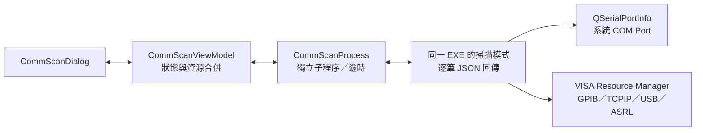
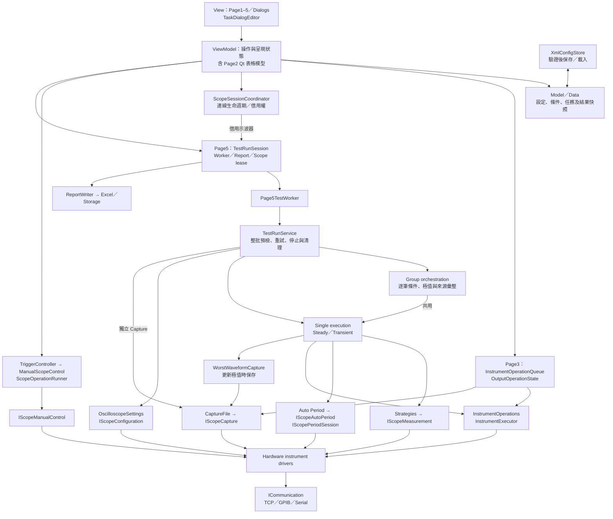

# ElectronicATE

以 Qt Widgets／C++17 開發的 Windows 電子 ATE 測試平台，整合電源、電子負載、繼電器與示波器控制。採 MVVM 分層，設定以 XML 保存，量測結果可追加至 Excel 報表。

[下載 v0.1.0-alpha.1](https://github.com/Jaxon-Su/ElectronicATE/releases/tag/v0.1.0-alpha.1)

## 操作入口

| 頁面 | 用途 |
| --- | --- |
| Page1 · Instruments | 設定型號、通訊地址、通道 Index 與 Load 同步角色；Scan Resources 列舉可用地址。 |
| Page2 · Conditions | 編輯 AC、DC、Relay、Load、Dynamic Load 條件；支援新增、刪除、複製貼上與捲動。 |
| Page3 · Control | 手動 ON／OFF／Change、觸發與量測、PNG／CSV／WFM 擷取。DC 可選整組或單台。 |
| Page4 · Commands | 手動通訊指令、History、Log；Command 可離線編輯，按鈕與右鍵皆可 Clear。63600 快速設定可填入 Channel、斜率與 Von 指令。 |
| Page5 · Queue Tasks | 編排 Single／Group 測試、Relay、Write Oscilloscope、Capture、Delay；執行、停止、重試與報表。 |

操作順序：**Page1 設定儀器 → Page2 建立條件 → Page3 手動確認，或 Page5 編排測試**。Page4 是獨立通訊工具。

Page2 一般點選／編輯保持原色，拖曳選取時反白；右鍵複製保留選取範圍。左右區塊維持 1：3，欄位過多時使用捲動列。

Page3 示波器連線失敗只停用 Trigger／Measure／Capture，其他儀器仍可操作。輸出操作中的按鈕顯示 `Working...`；命令可能送出但結果不明時顯示琥珀色 `UNKNOWN`，可重試 OFF。輸出啟用或未知時保留互鎖。操作結束後可確認離開程式，但關閉程式不代表儀器輸出已關閉。

## Page5：Single 與 Group Test

兩區皆提供 **Static、Dynamic、Turn on、Turn off、Short then turn on、Turn on then short**。

| 項目 | Single Test | Group Test |
| --- | --- | --- |
| 負載條件 | 一筆 Load／Dy Load | 勾選一筆或多筆，依 Page2 順序執行 |
| 搜尋流程 | 執行一次既有策略 | 每筆完整執行相同策略，暫態逐筆完成事件與清理 |
| Max／Min | 該筆各通道極值 | 跨條件各通道極值，附來源列號與名稱；相同值保留先取得者 |
| RMS／Mean | 最後一筆有效擷取 | 該通道最後一筆有效量測，附來源；不做跨條件平均 |
| Capture | 刷新任務極值時保存 | 共用整組極值候選，刷新時保存並附條件來源 |

Dynamic 使用 Dy Load，其餘使用 Load。Group 共用 Input、Search direction、等待時間與 Capture；適用的 Relay／Discharge 也共用。Auto Period 僅 Static／Dynamic 提供，勾選後逐筆執行。Single 與 Group 共用實作，Group 不另建示波器搜尋或 SCPI 流程。

- 任一成員失敗或停止，當次群組立即結束；保留已取得資料，其餘標示 `Skipped`。部分資料不代表整組完成。
- Fail Retry 從第一筆重跑，重新累積極值與 Capture 候選。使用者停止或清理失敗時不重試。
- Tasks 的 Result 顯示量測與來源；DUT Test 僅編輯設定。Excel 保存群組摘要及各條件明細。
- 對話框 Apply 才保存，Close／取消放棄修改。未選條件的草稿可保存，但不能執行。
- 多選與共同設定保存至 XML。Page2 重排依內容參照重新定位；條件修改、刪除或重複而無法唯一定位時，須重新選擇。
- 搜尋時間限制逐筆計算，整組耗時隨條件數增加。

### 策略流程

預設 Search direction 為 **BOTH**：先 Rise 再 Fall，每筆有效波形均累積 Max／Min。Rise／Fall 單邊模式只執行所選方向，另一側極值顯示 NA。RMS／Mean 取有效擷取值，不是跨次平均。

| 策略 | 每筆條件的主要流程 |
| --- | --- |
| Static／Dynamic | Input ON → Load ON → 等待穩定 → RUN／AUTO → Auto Period（若勾選）→ 新穩態參考 → NORMAL 下 Rise／Fall 搜尋。 |
| Turn on | 關機 → 放電 → 解除放電 → Single 待命 → 開機 → 等待事件。 |
| Turn off | 開機穩定 → 穩態參考 → 排除穩態觸發 → Single 保持待命 → 關機等事件。 |
| Turn on then short | 開機穩定 → 穩態參考 → 排除穩態觸發 → Single 保持待命 → 短路等事件。 |
| Short then turn on | 關機 → 短路與放電 → 保持短路、解除放電 → Single 待命 → 開機等事件。 |

Static／Dynamic 以 `Trigger CH Scale ÷ 25` 為步距，依實測極值向外推進 Level，直到正常等待逾時。每方向上限為 15 分鐘／100 輪。

四種暫態在每個 Level 重做完整事件；`Trials per level` 中任一次觸發算 HIT，全部未觸發才算 MISS。建立 HIT／MISS 邊界後二分收斂，容差為 `Trigger CH Scale ÷ 25`。Turn off／Turn on then short 的穩態探測不當作事件。回報的是實測波形極值，有限搜尋不保證涵蓋所有偶發尖峰。

### 擷取時序、Auto Period 與截幅

- 成功擷取後等待 **3 秒**，再次確認 STOP，才讀值、判斷截幅或保存；等待可取消。
- Auto Period 預設關閉。以 Trigger Source 通道連續三筆新擷取確認 PERIOD 差異在 5% 內，調整至目標 **5 週期**，再擷取驗證 **3～8 週期**。Write Oscilloscope 僅提供初始設定。
- 未截幅保留 Scale、Position、Offset；截幅時僅將受影響通道 Scale ×2，捨棄該記錄並重測。暫態重做完整事件，不能用縮放後的舊記錄代替。
- 通訊失敗、無效量測或超過限制回報失敗。Auto Period 仍可能將高頻漣波當作週期，需核對實際訊號。

### Capture 與報表

策略內的 **Capture worst Max / Min** 預設不勾選，格式預設 **WFM＋PNG**。每筆有效擷取刷新極值時，在改變設定前保存；不是每次觸發都保存。歷次候選檔保留，附當次 Trigger Level、通道量測及設定 JSON。Group 檔名附 `Load`／`DyLoad` 列號，JSON 與結果標示來源條件。

獨立 Capture 任務保存執行當時的波形；不代替策略內的極值保存。PNG 為畫面，CSV／WFM 為選定通道，AllCSV／AllWFM 為啟用通道各一份。Page3 Capture 通道與 Trigger Source 分開選擇。

勾選 Report 的結果寫入 File Path／File Name 指定的 Excel，同名檔案追加至同一份 Results 工作表，變更路徑或名稱才換檔。請保留程式產生的報表格式；經 Excel 另存或修改格式的檔案請使用新檔名。

## Scan Resources

列出電腦可見的 VISA 資源與系統 COM Port，供複製地址；不發送儀器指令、不修改設定，也不代表設備已回應。


```mermaid
flowchart LR
    UI["CommScanDialog"] <--> VM["CommScanViewModel<br/>狀態與資源合併"]
    VM <--> Process["CommScanProcess<br/>獨立子程序／逾時"]
    Process <--> Helper["同一 EXE 的掃描模式<br/>逐筆 JSON 回傳"]
    Helper --> Serial["QSerialPortInfo<br/>系統 COM Port"]
    Helper --> VISA["VISA Resource Manager<br/>GPIB／TCPIP／USB／ASRL"]
```

系統埠使用 `availablePorts()`；VISA 使用 `viFindRsrc("?*")`／`viFindNext()`。以 VISA 別名確認 COM／ASRL 對應後合併，不以數字相同猜測。TCPIP 範圍取決於 VISA 探索／設定；不掃整個網段，也不搜尋 Modbus Slave ID 或鮑率。

單次最長 15 秒、VISA 最多 512 筆。Stop／逾時終止子程序並保留已收到清單，避免 VISA 呼叫卡住主介面。Page1 的 **Connection Test** 則會另建短暫連線並查詢識別，與資源列舉不同。

## 整體架構

MainWindow／工廠負責組裝依賴；箭頭表示主要資料與執行關係。


```mermaid
flowchart TD
    View["View：Page1–5／Dialogs<br/>TaskDialogEditor"] --> VM["ViewModel：操作與呈現狀態<br/>含 Page2 Qt 表格模型"]
    VM --> Data["Model／Data<br/>設定、條件、任務及結果快照"]
    XML["XmlConfigStore<br/>驗證後保存／載入"] <--> Data
    VM --> P3["Page3：InstrumentOperationQueue<br/>OutputOperationState"]
    P3 --> Ops["InstrumentOperations<br/>InstrumentExecutor"]
    VM --> Session["ScopeSessionCoordinator<br/>連線生命週期／借用權"]
    VM --> Manual["TriggerController → ManualScopeControl<br/>ScopeOperationRunner"]
    Manual --> ManualAPI["IScopeManualControl"]
    VM --> RunSession["Page5：TestRunSession<br/>Worker／Report／Scope lease"]
    Session -->|借用示波器| RunSession
    RunSession --> Worker["Page5TestWorker"]
    RunSession --> Report["ReportWriter → Excel／Storage"]
    Worker --> Run["TestRunService<br/>整批預檢、重試、停止與清理"]
    Run --> Group["Group orchestration<br/>逐筆條件、極值與來源彙整"]
    Run --> Single["Single execution<br/>Steady／Transient"]
    Group -->|共用| Single
    Single --> Strategy["Strategies → IScopeMeasurement"]
    Single --> Period["Auto Period → IScopeAutoPeriod<br/>IScopePeriodSession"]
    Single --> Ops
    Run --> Config["OscilloscopeSettings<br/>IScopeConfiguration"]
    Single --> Worst["WorstWaveformCapture<br/>更新極值時保存"]
    Worst --> Capture["CaptureFile → IScopeCapture"]
    P3 --> Capture
    Run -->|獨立 Capture| Capture
    Strategy --> Driver["Hardware instrument drivers"]
    Period --> Driver
    Config --> Driver
    Capture --> Driver
    ManualAPI --> Driver
    Ops --> Driver
    Driver --> Transport["ICommunication<br/>TCP／GPIB／Serial"]
```

- **呈現與資料分離**：Page2 的 `ConditionRowsModel`／`GroupedConditionsModel` 是 ViewModel 層的 Qt 表格模型，負責欄列映射及編輯轉換；`Page2Model` 保存條件資料。
- **執行與 UI 分離**：Page3 使用背景操作佇列；Page5 使用任務快照與專用 Worker。兩者共用儀器操作實作，互鎖及關閉由主視窗協調。
- **群組重用策略**：`TaskSettings::Group` 保存條件清單與共同設定；`TestRunService` 逐筆執行既有策略，`groupmeasurementresults.h` 彙整含來源的結果。Group 不含儀器協定。
- **協定集中於 driver**：量測、週期、設定、手動控制及 Capture 各依賴能力介面。策略使用具名方法及型別化狀態，SCPI 組字與回覆解析由 MSO driver 處理。
- **生命週期**：Scope lease 保持執行期間資源有效；停止採合作式取消，清理完成後才釋放。報表與儲存由背景作業處理。
- **驗證邊界**：XML 先驗證後替換資料；任務數值規則與 UI 共用。`CheckArchitecture.cmake` 檢查禁止的分層依賴，核心模組不連結 Widgets／VISA。

### 資料夾

```text
ElectronicATE/
├── main.cpp                 # 程式入口
├── CMakeLists.txt / cmake/   # 建置模組與依賴檢查
├── XML/                     # 儀器模板
├── images/                  # 程式圖示
├── screenshots/             # README 畫面
└── src/
    ├── views/               # Page1–5、Dialogs、主視窗組裝
    ├── viewmodels/          # 操作、呈現狀態、Qt 表格模型
    ├── models/              # 設定／條件／任務資料與 XML 映射
    ├── data/                # 值型別、快照、共用設定規則
    ├── service/
    │   ├── taskpreparation/ # 條件參照、執行前準備
    │   ├── testrun/         # Single／Group 執行與結果彙整
    │   ├── oscilloscopestrategy/ # 穩態與暫態策略
    │   ├── capture/         # 擷取、極值候選與中繼資料
    │   ├── instrumentexecutor/  # 儀器操作協調
    │   ├── report/          # Excel 報表
    │   └── xml/             # 設定保存／載入
    ├── infrastructure/     # Worker、背景操作、儲存、掃描子程序
    ├── hardware/           # 儀器驅動、建立工廠與通訊
    └── ui/                 # 共用樣式、表格與控制器
```

## 設定與支援範圍

XML 僅支援目前格式，不轉換舊版欄位。空白草稿可保存，執行時另驗證完整性。條件數值接受有限數值；Load 支援既有 V／A 後綴與 `電壓/電流` 格式，不換算 mA 等倍率單位。

Load 同步角色為 `MASTER`／`SLAVE`／`NONE`；執行時由共用 InstrumentExecutor 檢查群組並套用。63640 使用 `63600-5` 模板與 `1,3,5,7,9` 通道。同步能力與時序須依接線及型號驗證。

| 類別 | 已提供模板／驅動 |
| --- | --- |
| AC Source | Delta DE-A3000AB；Chroma 61505／61509／6530 |
| DC Source | Chroma 62050／62075／62100／62150 H 系列，細部型號見 `XML/Instrument.xml` |
| DC Load | Chroma 6310／6310A／63600／63200A／63800 系列 |
| Oscilloscope | Tektronix MSO 4／5／6 系列 |
| Relay | Modbus RTU 4CH |

**限制**：6310／6310A／63600 的 CV 設定尚未完成；型號列入模板不代表所有模式均已支援。示波器策略、Group、Auto Period、Capture、DC Source 與同步時序仍須實機驗證，離線測試不能代替設備測試。

## 建置

Windows x64、C++17、Qt 6（Widgets／Xml／Network／SerialPort／Concurrent）、CMake 與 NI-VISA SDK／Runtime。開發環境使用 Qt 6.12.0 MinGW 64-bit；VISA Runtime 需另外安裝。

```powershell
cmake -S . -B build/release -G Ninja -DCMAKE_BUILD_TYPE=Release -DCMAKE_PREFIX_PATH=C:/Qt/6.12.0/mingw_64
cmake --build build/release --parallel 4
```

使用對應 Qt Kit 的編譯器環境；VISA 路徑可透過 `ELECTRONICATE_VISA_INCLUDE_DIR` 與 `ELECTRONICATE_VISA_LIBRARY_DIR` 指定。

## 畫面

### Page1 · Instruments


### Page2 · Conditions


### Page3 · Control


### Page4 · Commands


### Page5 · Queue Tasks


## 授權

軟體依「現狀」提供，使用前請自行驗證適用性及設備保護。詳細條款見 [LICENSE](LICENSE)；Qt 與其他第三方元件依各自授權使用。

作者：[Jaxon Su](https://github.com/Jaxon-Su)
