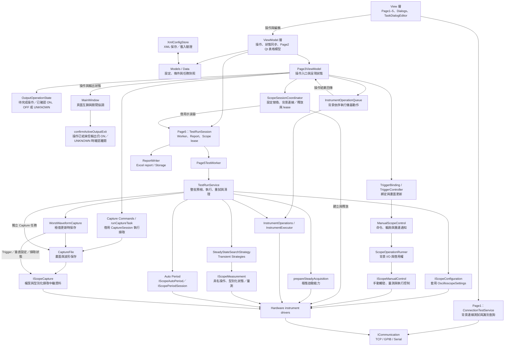

# ElectronicATE

電子 ATE 自動化測試系統

ElectronicATE 是一套用於電源供應器、電子負載、示波器與繼電器控制的 Windows 桌面測試平台。專案以 Qt Widgets 實作 GUI，透過 MVVM 分層管理 UI、測試條件、儀器設定、XML 保存/載入與硬體控制流程。

---

## 目前功能

### Page1：儀器與通訊設定

- 從 `XML/Instrument.xml` 讀取儀器模板與可選型號。
- 示波器選項僅提供 MSO 4/5/6 系列；已移除 DPO7000／DPO4000 選項與停用實作。
- 支援多組 Load、Relay、Oscilloscope、InputSource 設定。
- 提供 DC Source1、DC Source2、DC Source3 三台獨立儀器設定。
- 支援 Load Outputs / Relay Outputs / DC Input 數量設定；預設皆為 1，所有模組預設勾選。
- 支援通道型儀器的 subModel、output index、sync role 設定。
- Load sync role 支援 `MASTER` / `SLAVE` / `NONE`。
- 63640 使用 `63600-5` 模板，通道為 `1,3,5,7,9`。
- 通訊設定目前下拉可選 GPIB、TCP/IP、Serial、Modbus RTU。
- `Scan Resources` 列出 VISA 通訊資源與系統 COM Port，合併對應的 COM／VISA 地址，支援複製、停止與逾時。架構與偵測範圍見下方「Scan Resources」說明。
- Page1 左側的 `Scan Resources` 用來列舉電腦可見的通訊資源，供使用者查看與複製地址。列出的資源不代表儀器已回應；程式不執行儀器識別、Modbus 站號搜尋或輸出控制，也不修改 Page1 或 XML 設定。

### Page2：測試條件表格

- AC Input 條件表：phase mode、Vin、frequency、phase；數值儲存格支援方向鍵上下左右移動，切換前保存有效輸入。
- DC Source 群組表：自訂條件名稱、Vin、I Limit，依 Page1 DC Input 數量顯示 Index1～3；隱藏欄位保留設定。
- Relay 表：繼電器輸出條件。
- Load 表：mode、range、name、Vo、Von 與各條件電流/電壓資料。
- Dynamic Load 表：range、Vo、Von、T1/T2 與動態電流條件。
- 支援新增/刪除列、表格 copy/paste/delete、鍵盤導覽與資料同步。一般點選與編輯保持原色；拖曳選取的列以藍色反白，右鍵複製時保留範圍。右鍵選單顯示選取與剪貼簿筆數。
- 左右區塊維持 1：3，左側採精簡欄寬；Load / Dynamic Load 欄位過多時可水平捲動，資料列過多時可垂直捲動。
- 依 Page1 output 數量動態更新表頭、欄位與功率欄。
- Load / Dynamic Load 會依儀器 subModel 提供可用 range/mode 選項。

### Page3：手動控制與擷取

- AC Input：Power On / Off / Change。
- Relay 下方提供 DC Input 控制：先選 Page2 條件組，再選 `Group: all enabled DC` 或 `Single: DC1／DC2／DC3`。
- 整組 On／Off／Change 控制 Page1 數量範圍內且勾選的 DC Source；單台操作只套用該條件組中指定電源的 Vin／I Limit，其他電源保持原狀。
- 分別顯示三台 DC 輸出狀態；操作期間鎖定選擇並透過背景佇列依序執行。整組內只要有電源啟用，切換按鈕即提供 OFF；Change 僅更新設定，不會開啟輸出。
- Load：Load On / Off / Change。
- Dynamic Load：Dynamic Load On / Off / Change。
- Relay：Relay On / Off / Change。
- Load 與 Dynamic Load 在 UI 上互鎖，避免同時啟用。
- 示波器 trigger widget 依機型動態建立。
- 支援示波器 PNG、CSV、All CSV、WFM、All WFM 擷取；All WFM 依啟用通道各輸出一個檔案。
- Capture 區塊提供獨立 CH 選單，CSV／WFM 使用選取的通道，與 Trigger Source 分開；PNG 儲存整個畫面，AllCSV／AllWFM 儲存所有啟用通道。
- 支援示波器 reconnect request 與 trigger controller 綁定。
- 示波器連線中或連線失敗時，僅停用 Trigger／Measure／Capture；AC／DC／Load／Dynamic Load／Relay 仍可獨立控制。輸出啟用或狀態未知時，仍鎖定設定與其他控制頁，避免操作衝突。
- 輸出指令尚未送出就連線失敗時，按鈕恢復原本狀態；指令可能已送出但結果不明時顯示 `UNKNOWN`，可再次嘗試 OFF。AC／DC／Load／Dynamic／Relay 統一以琥珀色呈現未知狀態、灰色呈現 `Working...`，避免誤認為藍色 ON 狀態。錯誤提示出現前會先更新按鈕及操作鎖定。
- 背景操作結束後，即使輸出仍 ON 或未知，也可在離開確認視窗選擇 `Close application`；關閉程式不代表已關閉儀器輸出，仍須直接確認設備狀態。
- 保留 AUTO／NORMAL、Single、Run／Stop 與手動 Trigger Level 控制；已移除原本隱藏的 Semi-Auto Trigger。
- Trigger 的 Step 右側提供 Scale/25 按鈕，讀取目前 Source 通道的垂直 Scale 後設定步距，並保留小步距所需的小數位。

### Page4：通訊指令工具

- 提供手動連線、斷線、送指令與通訊記錄。
- 支援 timeout 設定。
- 內建常用 SCPI 按鈕：`*IDN?`、`*RST`、`*CLS`、`*OPC?`。
- `63600…` 可選實體 Channel、Static／Dynamic／Both 斜率設定，輸入 Rise／Fall（A/µs）與 Von（V），填入 Command 後按 Send 送出；不切換模式或開啟負載。
- 保存 address / command history，方便調試儀器通訊。

### Page5：全自動測試

- 執行 Static／Dynamic、Turn on／Turn off、Turn on then short／Short then turn on、Relay、Write Oscilloscope、Capture 與 Delay。
- AC／DC Input 分開選擇，未設定的空白條件不列入選項；未選擇時保持 None。
- 示波器分別執行 Rise／Fall 搜尋，支援超幅放大後重新擷取與 Auto Period。
- 執行時借用 Page3 示波器並互鎖，支援取消、重試與失敗清理。
- 目前僅啟用 MSO 4/5/6 系列；尚待實機驗證。
- Capture 支援 PNG、CSV／AllCSV、WFM／AllWFM；執行結果顯示於 Tasks 的 Result，DUT Test 僅編輯任務設定。
- 依 File Name／File Path 自動保存 Excel 報表；同名檔案追加至同一份 Results 工作表，更換名稱或路徑才建立另一份報表，記錄勾選 Report 項目的量測數值、狀態與異常摘要。請保留程式產生的報表格式；經 Excel 另存或修改格式的檔案，請改用新檔名。

## 五種示波器抓取策略

Static／Dynamic 使用相同的波形搜尋方式，以下合併為一類，共五類。每類提供 Search direction：BOTH／Rise／Fall，預設 BOTH。BOTH 分開執行 Rise（搜尋 Max）與 Fall（搜尋 Min）；Rise／Fall 只執行所選方向。未選的極值顯示 NA，RMS／Mean 保留有效擷取結果。以下為目前程式流程，仍待實機驗證。

### 1. Static／Dynamic

Input ON → 靜態／動態 Load ON → 等待穩定 → 示波器 RUN／Trigger AUTO。

接著執行 Auto Period（在各筆 Static／Dynamic 設定中勾選，預設關閉）：自動調整時間軸，目標顯示 **5 個週期**，重新擷取確認為 **3～8 個週期**即接受；未啟用則沿用目前時基。Write Oscilloscope 僅設定初始時基，不控制此開關。

最後 AUTO 擷取新的穩態參考 → 切換 NORMAL → 分別進行 Rise／Fall 搜尋；逐輪 Single 擷取並調整 Level，無觸發時 STOP，結束該方向搜尋。

### 2. Turn on

關機 → 放電 → 解除放電 → Single 待命 → 開機 → 等待觸發並量測。

每次試驗重做完整開機流程，以不同 Level 搜尋事件邊界。

### 3. Turn off

開機穩定 → AUTO 穩態參考 → 調整 Level 排除穩態觸發 → Single 保持待命 → 關機等觸發。

依結果更新 Level，重新開機穩定後重試。

### 4. Turn on then short

開機穩定 → AUTO 穩態參考 → 調整 Level 排除穩態觸發 → Single 保持待命 → 短路等觸發。

重試前：關機 → 保持短路並放電 → 解除放電與短路 → 重新開機穩定。

### 5. Short then turn on

關機 → 短路 → 放電 → 保持短路、解除放電 → Single 待命 → 開機量測。

每次試驗重做完整流程，再測下一個 Level。

### 量測方式

- BOTH 的每筆有效波形均累積 Max、Min；Rise／Fall 只決定觸發方向與門檻推進。RMS／Mean 使用最後一筆有效量測，並非跨次平均。單邊模式只顯示所選極值。
- Static／Dynamic 先量穩態，再調整觸發門檻；四種暫態則重複開關機或短路，逐步縮小搜尋範圍。
- 波形超出垂直量程時，自動放大刻度後重測；通訊異常或超過限制則回報失敗。

### 沒有觸發時

| 策略 | 處理方式 |
| --- | --- |
| Static／Dynamic | 保留已量到的穩態與搜尋結果。 |
| Turn on／Short then turn on | 保留另一側的有效事件；兩側都沒有事件則回報失敗（NA）。 |
| Turn off／Turn on then short | 搜尋正常結束後，將穩態值與事件值合併，保留較大 Max、較小 Min；沒有事件時使用穩態值，RMS／Mean 顯示 NA。 |

### 技術細節

#### 搜尋方式：穩態追蹤與暫態二元搜尋

**Static／Dynamic** 先以 AUTO 擷取穩態參考，再分別搜尋正／負緣。目前不是二元搜尋：步距使用 `觸發 CH Scale × 0.04`，正緣以 `max(Level + 步距, 本次 Max + 步距)` 更新門檻，負緣以 `min(Level − 步距, 本次 Min − 步距)` 更新，直到正常等待逾時、沒有觸發。

**四種暫態** 使用以下流程：

1. 在同一 Level 重複 `Trials per level` 次試驗；任一次事件觸發算 **HIT**，全部未觸發才算 **MISS**。
2. 只有 HIT 時，向外擴張門檻尋找 MISS；首次只有 MISS 時，向內尋找事件。因此一次 MISS 不代表整個搜尋結束。
3. 建立 HIT／MISS 邊界後，下一個 Level 取兩者中點：`(HIT Level + MISS Level) ÷ 2`。
4. 反覆縮小區間，直到寬度不超過 `Search tolerance`。若新波形出現更大極值，會重新擴大搜尋邊界。

負緣使用相同概念，向較低的 Level 搜尋。Turn off／Turn on then short 會先排除穩態觸發，只有施加關機／短路之後的擷取才算事件。

**範例：** 已知 54 V 為 HIT、58 V 為 MISS，觸發 CH Scale 為 12.5 V/div，因此自動容差為 0.5 V：

| 試探 Level | 結果 | 更新後區間 |
| ---: | --- | --- |
| 56 V | MISS | 54～56 V |
| 55 V | HIT | 55～56 V |
| 55.5 V | HIT | 55.5～56 V，寬度 0.5 V，結束 |

以上假設事件可重現、峰值為 55.68 V，僅示範二分過程。最後回報的是波形實際量到的 Max，而非最後的 Level；有限次數搜尋不保證涵蓋所有偶發尖峰。

#### 步距公式與收斂容差

Static／Dynamic 與四種暫態均依觸發來源通道的垂直刻度換算步距：

```text
初始步距 = 觸發 CH Scale ÷ 25（正值）
暫態搜尋容差 = 觸發 CH Scale ÷ 25（正值）
```

## Load / Dynamic Load Sync 控制

Page1 的 `MASTER`／`SLAVE`／`NONE` 保存同步角色；編輯設定時不會直接操作硬體。Page3 手動控制與 Page5 自動測試共用 InstrumentExecutor，在執行 Load／Dynamic Load 動作時套用設定。

啟用同步時，程式先建立與檢查同步群組，再依動作暫停同步、寫入負載參數、恢復角色及切換輸出。同步成員由 Master 控制，獨立成員分別控制；63640／63600-5 的 `1,3,5,7,9` 通道各自參與群組判定。實際同步能力與時序仍須依儀器接線及型號驗證。

---

## 支援儀器

### AC Source

- Delta A3000：`DE-A3000AB`
- Chroma：`61505`、`61509`、`6530`

### DC Source (待驗證)

- Chroma 62050：`62050H-40`、`62050H-450`、`62050H-600`
- Chroma 62075：`62075H-30`
- Chroma 62100：`62100H-40`、`62100H-450`、`62100H-600`、`62100H-1000`、`62100H-30`
- Chroma 62150：`62150H-40`、`62150H-450`、`62150H-600`、`62150H-1000`

### DC Load

- Chroma 6310：`63101`、`63102`、`63103`、`63105`、`63106`、`63108`、`63112`
- Chroma 6310A：`63101A`、`63102A`、`63103A`、`63105A`、`63106A`、`63107A`、`63108A`、`63110A`、`63112A`、`63113A`、`63115A`、`63123A`
- Chroma 63600：`63610-80-20`、`63630-80-60`、`63640-80-80`、`63640-150-60`、`63630-600-15`
- Chroma 63200A：150 V、600 V、1200 V 系列多型號
- Chroma 63800：`63802`、`63803`、`63804`

### Oscilloscope

- Tektronix MSO 4/5/6 Series：MSO44(B)、MSO46(B)、MSO54(B)、MSO56(B)、MSO58(B)、MSO58LP、MSO64(B)、MSO66B、MSO68B、LPD64

### Relay

- Modbus RTU 4CH Relay：`Modbus_RTU_4CH`。

---

## 整體架構

介面採 MVVM；下圖表示主要資料與執行路徑，實際硬體依賴由 MainWindow 與工廠組裝後注入。


```mermaid
flowchart TD
    Views["View 層<br/>Page1–5、Dialogs、TaskDialogEditor"] -->|操作與編輯| VM["ViewModel 層<br/>操作、狀態同步、Page2 Qt 表格模型"]
    VM --> Models["Models / Data<br/>設定、條件與任務快照"]
    XML["XmlConfigStore<br/>XML 保存／載入驗證"] <--> Models

    Views --> Probe["Page1：ConnectionTestService<br/>背景連線測試與識別查詢"]
    Probe --> Transport
    VM --> P3["Page3ViewModel<br/>操作入口與呈現狀態"]
    P3 --> OutputState["OutputOperationState<br/>待完成操作／已確認 ON、OFF 或 UNKNOWN"]
    P3 --> Manual["InstrumentOperationQueue<br/>背景依序執行儀器動作"]
    Manual --> Ops["InstrumentOperations / InstrumentExecutor"]
    Manual -->|操作結果回傳| P3
    P3 -->|操作與輸出狀態| Window["MainWindow<br/>頁面互鎖與關閉協調"]
    Window --> CloseUI["confirmActiveOutputExit<br/>操作已結束但輸出仍 ON／UNKNOWN 時確認離開"]
    P3 --> Trigger["TriggerBinding / TriggerController<br/>綁定與畫面更新"]
    Trigger --> ScopeControl["ManualScopeControl<br/>命令、輪詢與重連通知"]
    ScopeControl --> ScopeIO["ScopeOperationRunner<br/>背景 I/O 與借用權"]
    P3 --> ScopeSession["ScopeSessionCoordinator<br/>設定替換、背景連線／釋放與 lease"]
    P3 --> Commands["Capture Commands / runCaptureTask<br/>借用 CaptureSession 執行擷取"]
    Commands --> Capture["CaptureFile<br/>畫面與波形保存"]

    VM --> Session["Page5：TestRunSession<br/>Worker、Report、Scope lease"]
    ScopeSession -->|借用示波器| Session
    Session --> Worker["Page5TestWorker"]
    Worker --> Run["TestRunService<br/>整批預檢、執行、重試與清理"]
    Session --> Report["ReportWriter<br/>Excel report / Storage"]
    Run --> Strategy["SteadyStateSearchStrategy<br/>Transient Strategies"]
    Strategy --> Measurement["IScopeMeasurement<br/>具名操作、型別化狀態／量測"]
    Run --> Period["Auto Period<br/>IScopeAutoPeriod／IScopePeriodSession"]
    Run --> Startup["prepareSteadyAcquisition<br/>穩態啟動能力"]
    Run --> Ops
    Run --> Configuration["IScopeConfiguration<br/>套用 OscilloscopeSettings"]
    Configuration --> Drivers
    Run --> Worst["WorstWaveformCapture<br/>極值更新時保存"]
    Worst --> Capture
    Run -->|獨立 Capture 任務| Capture
    Capture --> CaptureAPI["IScopeCapture<br/>檔案與型別化擷取中繼資料"]
    Worst -->|Trigger／垂直設定／擷取狀態| CaptureAPI

    ScopeIO --> ManualAPI["IScopeManualControl<br/>手動觸發、量測與執行控制"]
    ManualAPI --> Drivers["Hardware instrument drivers"]
    ScopeSession -->|建立與釋放| Drivers
    Startup --> Drivers
    Ops --> Drivers
    Measurement --> Drivers
    Period --> Drivers
    CaptureAPI --> Drivers
    Drivers --> Transport["ICommunication<br/>TCP / GPIB / Serial"]
```


Page3 手動操作由背景作業執行，不經過 Page5 的 TestRunSession／TestRunService；兩者共用儀器操作與 Capture 能力。

Page3 透過 `ScopeSessionCoordinator` 管理示波器連線及生命週期；Page5 執行期間透過借用權（Scope lease）維持儀器有效並互鎖。`ManualScopeControl` 透過 `IScopeManualControl` 處理手動命令與輪詢，不依賴 Widgets 或完整的 `Oscilloscope` 類別；TriggerController 負責畫面事件與顯示。MainWindow／工廠組裝依賴，結果與進度經 signal 回到 ViewModel，再更新畫面。圖中箭頭表示主要資料與執行關係。

Page3ViewModel 分別提供示波器可用狀態、待完成操作與輸出狀態。示波器連線失敗只限制 Trigger／Measure／Capture；其他儀器仍可獨立操作。`InstrumentOperationResult` 將成功、輸出未改變或已確認的輸出狀態帶回 `OutputOperationState`，ViewModel 先同步按鈕與互鎖，再顯示錯誤。View 負責 `Working...`／`UNKNOWN` 的文字與樣式；MainWindow 等待未完成操作，並在操作結束但輸出仍 ON／UNKNOWN 時，透過 `src/ui/manualcontrolclose.h` 提供離開確認。這個確認不會把輸出狀態改成 OFF。


| 層級 | 職責 | 目錄 |
| --- | --- | --- |
| View | 頁面、對話框、使用者事件與依賴組裝 | `src/views` |
| ViewModel | 操作入口、呈現狀態與 Qt 表格資料映射 | `src/viewmodels` |
| Model / Data | 設定、條件、任務與結果資料 | `src/models`、`src/data` |
| Service | 測試執行、策略、儀器操作、Capture 與 XML | `src/service` |
| Infrastructure | 背景作業、Worker 生命週期、報表排程與儲存 | `src/infrastructure` |
| Hardware | 儀器驅動、通訊與硬體資源管理 | `src/hardware` |
| 共用 UI | 樣式、表格工具與 Page3 觸發控制器 | `src/ui` |

### 主要設計

操作流程：**Page1 設定儀器 → Page2 建立條件 → Page3 手動確認，或 Page5 編排並執行測試**。Page4 為獨立通訊指令工具。

---

## 圖片展示

### Page1：儀器設定


### Page2：測試條件表格


### Page3：手動控制


### Page4：通訊指令工具


### Page5：全自動測試


---

## 目前限制

- 示波器策略、Auto Period、Capture 與同步控制仍需實機驗證；離線測試不能代替儀器驗證。
- Chroma 6310／6310A／63600 的 CV 設定尚未完成；型號列入清單不代表所有模式均已支援。

---

## 授權

ElectronicATE 秉持分享與交流精神公開原始碼。本軟體依「現狀」提供，不提供任何明示或默示之擔保。使用者應自行驗證其適用性，並採取必要的設備保護與安全措施。在適用法律允許的最大範圍內，作者及貢獻者不對因使用或無法使用本軟體所造成的損失承擔責任，包括設備損壞、資料遺失及營運損失。詳細授權條款以 LICENSE 為準；Qt 與其他第三方元件仍依各自授權條款使用。

---

## 作者

Jaxon Su  
GitHub: [@Jaxon-Su](https://github.com/Jaxon-Su)
